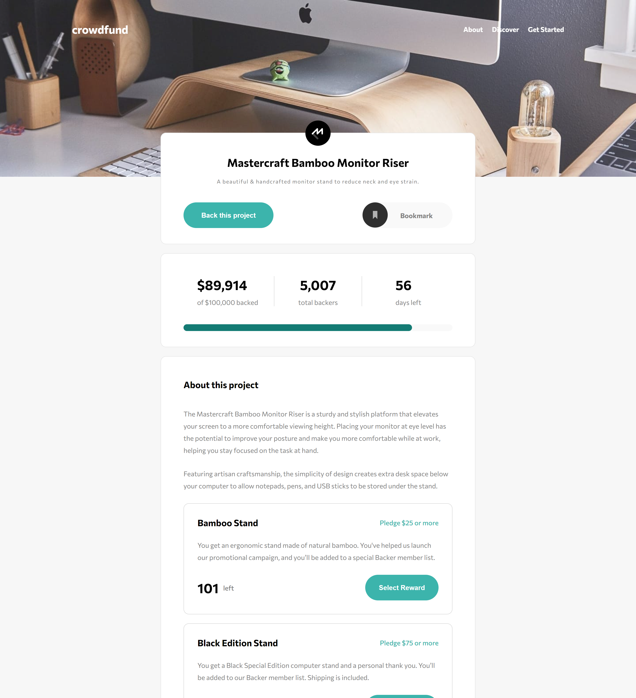
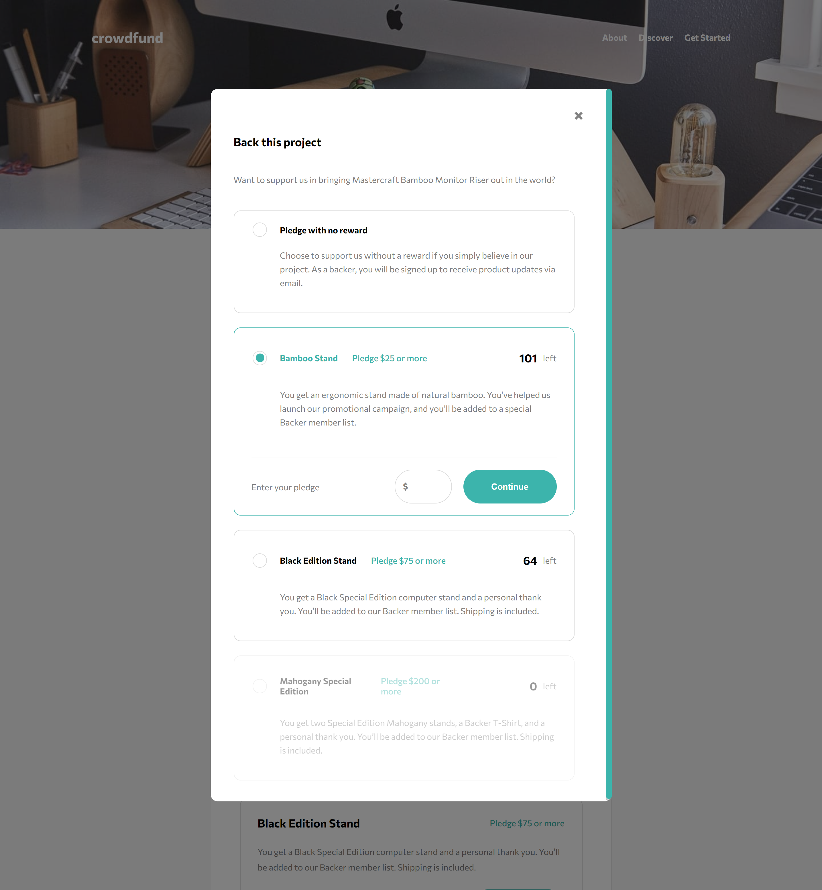
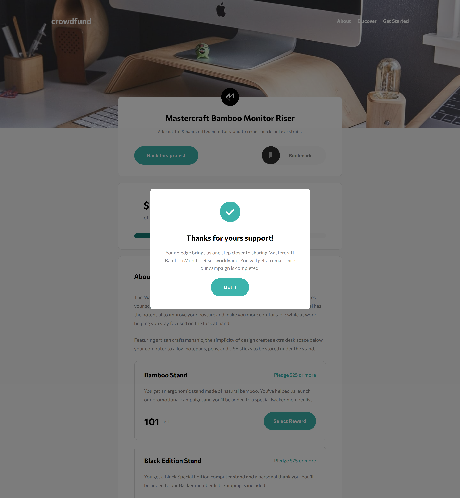
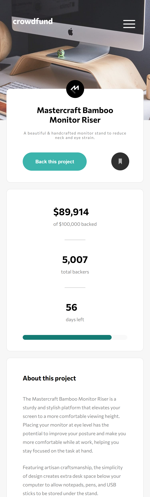
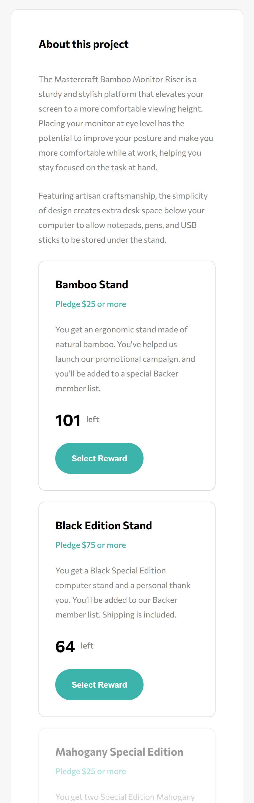
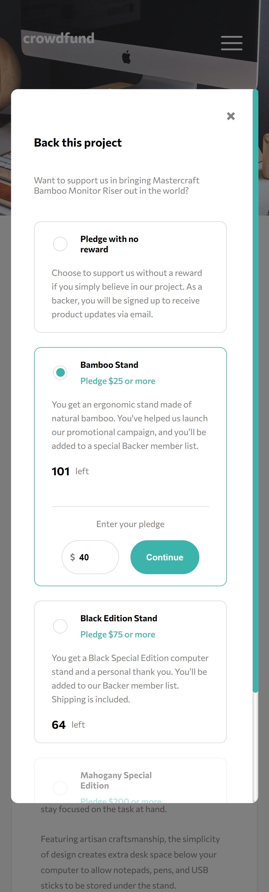
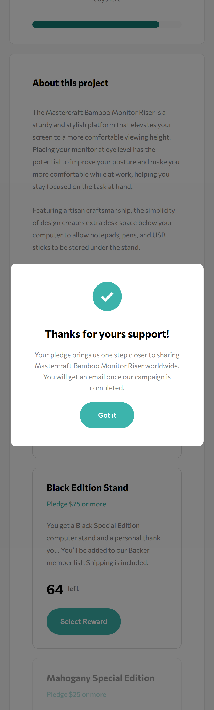

#Crowdfunding product page solution

## Table of contents

- [Screenshot](#screenshot)
- [Links](#links)
- [Built with](#built-with)
- [Author](#author)

### Screenshots

####Desktop view

## 

---

####Mobile view

### Links

- Solution URL: [Solution](https://github.com/11Samo/crowdfunding-product-page)
- Live Site URL: [Crowdfunding page](https://11samo.github.io/crowdfunding-product-page/)

### Built with

- Semantic HTML5 markup
- CSS custom properties
- Flexbox
- CSS Grid
- Mobile-first workflow

## Author

- Website - Samuel Kurnas
